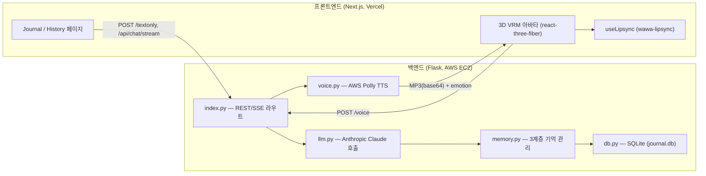

# Galatea

Galatea는 사용자가 하루의 생각이나 고민을 글로 남기면, Claude 기반의 AI 심리상담사가 이를 분석해 공감적인 피드백을 들려주고, 그 대답을 3D VRM 아바타가 감정 표현과 입모양(lipsync)까지 곁들여 음성으로 전달해주는 저널링 웹 애플리케이션입니다.

단순히 그때그때 답하는 챗봇이 아니라, 대화가 쌓일수록 사용자를 더 깊이 이해하도록 설계된 **3계층 장기기억 시스템**이 핵심입니다.

## 목차

- [주요 기능](#주요-기능)
- [시스템 구성](#시스템-구성)
- [기술 스택](#기술-스택)
- [프로젝트 구조](#프로젝트-구조)
- [장기기억 시스템](#장기기억-시스템)
- [API 엔드포인트](#api-엔드포인트)
- [로컬 개발 환경](#로컬-개발-환경)
- [환경 변수](#환경-변수)
- [배포](#배포)
- [참고 자료](#참고-자료)

## 주요 기능

- **AI 저널 상담**: 사용자가 쓴 글을 심리상담사 페르소나(`Galatea`)가 분석하여 공감적·건설적인 피드백 제공
- **스트리밍 응답**: SSE(Server-Sent Events)로 LLM 응답을 실시간 타이핑 효과로 전달
- **3D 아바타 인터랙션**: VRM 아바타가 답변 음성에 맞춰 입모양을 움직이고(lipsync), 감정에 따라 표정을 바꾸며, 대기 중엔 자동으로 눈을 깜빡임
- **음성 합성**: AWS Polly(neural, SSML)로 답변을 TTS 변환
- **감정 분류**: 답변의 어조를 5가지 감정(joy/angry/sorrow/fun/neutral)으로 분류해 아바타 표정에 매핑
- **장기기억**: 세션 요약 → 반복 패턴 추출 → 장기 사용자 프로필 갱신의 3단계 압축 기억으로, 대화가 누적될수록 더 맥락 있는 상담 제공
- **대화 히스토리**: 전체 대화 및 세션별 요약 조회

## 시스템 구성



- **프론트엔드**는 Vercel에 배포되며, `NEXT_PUBLIC_API_URL`을 통해 백엔드 API를 호출합니다.
- **백엔드**는 AWS 서버에서 gunicorn(unix socket) + nginx(`galatea.conf`, TLS)로 서비스되고, `master` 브랜치에 push되면 GitHub Actions(`.github/workflows/deploy.yml`)가 SSH로 접속해 `git pull` 후 systemd 서비스를 재시작합니다.
- 원래는 Unity 클라이언트로 시작한 프로젝트였으나(`unity6.db` 등 흔적 존재), 현재는 Three.js/VRM 기반 웹 아바타로 완전히 전환되었습니다.

## 기술 스택

| 영역 | 기술 |
|---|---|
| 프론트엔드 | Next.js 15 (App Router, Turbopack), React 19, TypeScript, Tailwind CSS |
| 3D 아바타 | Three.js, @react-three/fiber, @react-three/drei, @pixiv/three-vrm |
| 립싱크 | wawa-lipsync (Web Audio 기반 viseme 분석) |
| 백엔드 | Flask, Gunicorn |
| LLM | Anthropic Claude (`claude-sonnet-4-6`, `claude-haiku-4-5`) |
| 음성 합성 | AWS Polly (boto3, neural voice, SSML) |
| 데이터베이스 | SQLite |
| 배포 | Vercel(프론트), AWS EC2 + nginx + systemd(백엔드), GitHub Actions(CD) |

## 프로젝트 구조

```
galatea/
├── app/                        # Next.js App Router 페이지
│   ├── page.tsx                # 메인: 저널 작성 + 스트리밍 응답
│   ├── diary/page.tsx          # 저널 작성 (비스트리밍 버전)
│   ├── avatar/page.tsx         # 3D VRM 아바타 + 음성 대화 화면
│   ├── history/page.tsx        # 전체 대화 히스토리 조회
│   ├── input-history.tsx       # 아바타 화면의 텍스트 입력 + 음성 응답 처리
│   └── layout.tsx / globals.css
├── utils/
│   ├── useLipsync.ts           # 립싱크 · 감정 표현 · 눈 깜빡임 훅
│   ├── LoadMixamoAnimation.ts  # Mixamo FBX 애니메이션 → VRM 리타게팅
│   └── MixamoVrmRigMap.ts      # Mixamo 본 ↔ VRM 휴머노이드 본 매핑
├── public/
│   ├── experience/hero.vrm     # 아바타 3D 모델
│   └── animation/*.fbx         # Idle/Talk/Landing/Wander 애니메이션
├── api/                        # Flask 백엔드
│   ├── index.py                # 라우트 정의
│   ├── llm.py                  # Claude 호출 (채팅/감정분류/기억 요약)
│   ├── memory.py               # 3계층 장기기억 라이프사이클 관리
│   ├── db.py                   # SQLite 연결 및 CRUD
│   ├── voice.py                # AWS Polly TTS
│   └── wsgi.py                 # 로컬 실행 / gunicorn 진입점
├── galatea.conf                # nginx 리버스 프록시 + TLS 설정
├── vercel.json                 # 프론트 배포 시 CORS 헤더 설정
├── requirements.txt            # 백엔드 Python 의존성
└── package.json                # 프론트 의존성 및 스크립트
```

## 장기기억 시스템

`memory.py`가 관리하는 3계층 압축 기억으로, 대화가 쌓일수록 상위 레이어가 갱신되어 시스템 프롬프트에 함께 주입됩니다.

| 레이어 | 내용 | 갱신 주기 | 저장 위치 |
|---|---|---|---|
| Layer 1 | 세션(하루 단위) 요약 | 날짜가 바뀌어 세션이 닫힐 때마다 | `sessions.raw_summary` |
| Layer 2 | 반복되는 감정/주제 패턴 | 요약된 세션 7개마다 | `memory_layers` (layer=2) |
| Layer 3 | 장기 사용자 프로필 | 요약된 세션 30개마다 | `memory_layers` (layer=3) |

세션 경계는 날짜 기준(하루 1세션)이며, 새 날짜에 처음 메시지가 오면 이전에 닫히지 않은 세션을 자동으로 닫고 요약을 생성한 뒤, 필요 시 Layer 2·3 갱신까지 연쇄적으로 트리거합니다(`memory.get_or_create_today_session`).

## API 엔드포인트

| 메서드 | 경로 | 설명 |
|---|---|---|
| GET | `/` | 헬스체크 |
| POST | `/textonly` | 텍스트 응답 (form: `text`) |
| POST | `/voice` | 텍스트 응답 + TTS 음성 + 감정 (form: `text`) |
| POST | `/api/chat/stream` | SSE 스트리밍 응답 (json: `message`) |
| GET | `/history` | 전체 대화를 user/assistant 쌍으로 반환 |
| GET | `/sessions` | 최근 세션 목록과 요약 반환 |

## 로컬 개발 환경

### 프론트엔드

```bash
npm install
npm run dev   # http://localhost:3000
```

### 백엔드

```bash
python3 -m venv .venv
source .venv/bin/activate
pip install -r requirements.txt
python api/wsgi.py   # http://localhost:2174
```

## 환경 변수

프로젝트 루트 `.env`에 설정합니다.

| 변수 | 용도 |
|---|---|
| `NEXT_PUBLIC_API_URL` | 프론트엔드가 호출할 백엔드 API 주소 |
| `ANTHROPIC_API_KEY` | Claude API 키 |
| `ALLOWED_ORIGIN` | Flask-CORS 허용 origin (쉼표로 다중 지정 가능) |

AWS Polly 사용을 위해 `boto3`가 참조하는 AWS 자격 증명(환경변수 또는 `~/.aws/credentials`)도 별도로 필요합니다.

## 배포

- **프론트엔드**: Vercel에 배포. `vercel.json`에서 `/api/*` 요청에 대한 CORS 헤더를 지정합니다.
- **백엔드**: AWS 서버에서 gunicorn이 유닉스 소켓으로 `wsgi:app`을 서비스하고, nginx(`galatea.conf`)가 2174 포트에서 TLS 종료 후 해당 소켓으로 프록시합니다.
- **CD**: `master` 브랜치에 push되면 GitHub Actions(`.github/workflows/deploy.yml`)가 SSH로 서버에 접속해 `git pull` 후 `systemctl restart galatea`를 실행합니다.

## 참고 자료

- [Nginx 관련 이슈 (velog)](https://btcd.tistory.com/1487)
- [Nginx "No such file or directory" 해결 (Stack Overflow)](https://stackoverflow.com/questions/58526531/nginx-no-such-file-or-directory)
- [WikiDocs 참고](https://wikidocs.net/177312)
- [systemd/gunicorn 관련](https://yelimkim98.tistory.com/37)
- [배포 환경 구성](https://yunamom.tistory.com/226)
- [Let's Encrypt 인증서 발급](https://velog.io/@utcloud/Letsencrypt-%EC%9D%B8%EC%A6%9D%EC%84%9C-%EB%B0%9C%EA%B8%89%EB%B0%9B%EA%B8%B0)
- [배포 트러블슈팅](https://soyoung-new-challenge.tistory.com/116)
- [Gunicorn + Nginx로 Flask 서비스하기 (DigitalOcean)](https://www.digitalocean.com/community/tutorials/how-to-serve-flask-applications-with-gunicorn-and-nginx-on-ubuntu-18-04)
